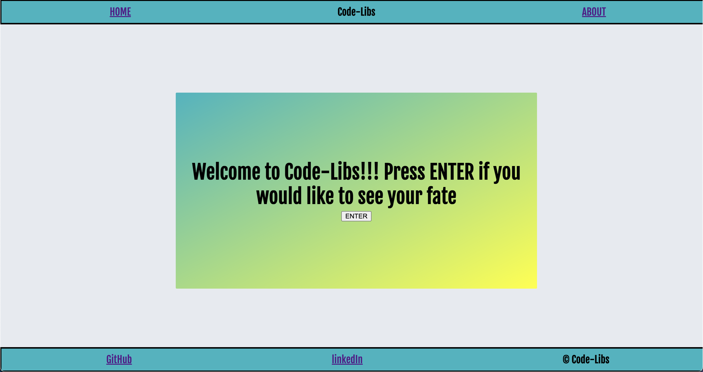
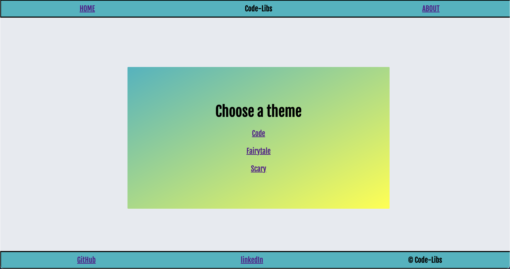
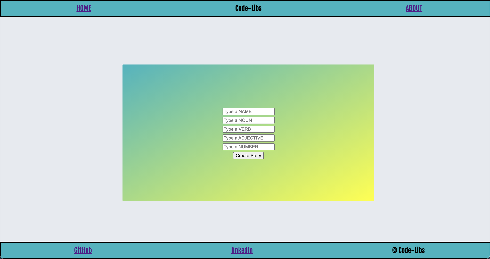

# Code-Libs

Choose your own adventure Mad-Libs game
Link: https://61787ed917adc100073bda04--project-3-frontend-lib.netlify.app/story

## Technologies Used:

- HTML5
- SCSS
- JavaScript
- Google Fonts
- Mongoose/MongoDB
- Node JS
- Express
- Heroku
- Netlify

## Screen Shots:
### Home

### Index

### Form

## Getting Started:

- Open to home and 'Enter' game
- Choose a theme
- Type in inputs for form
- Choose route you would like to take

## Future Enhancements

- Add form components to second layers
- Add second layer of choose your own route
- Add modal popup to results of game